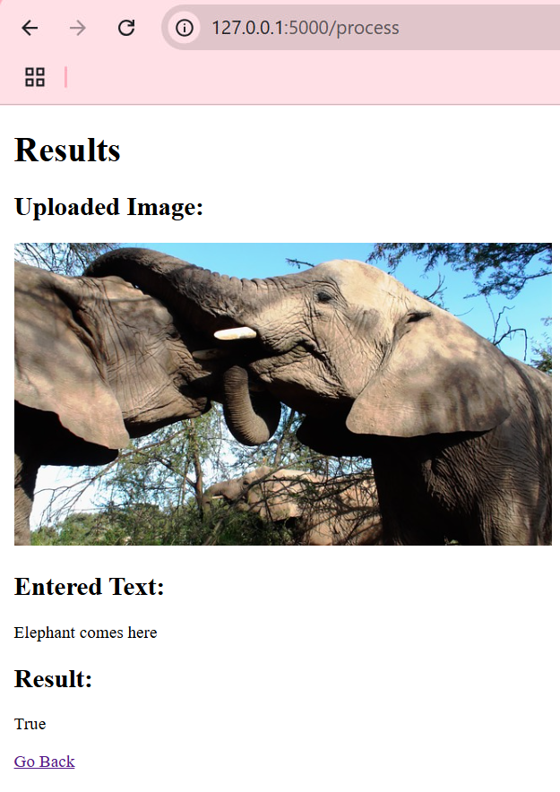

# Animal Classification and NER Model

## Table of Contents

- [Overview](#overview)
- [Project Structure](#project-structure)
- [Requirements](#requirements)
- [Dataset](#dataset)
- [Usage](#usage)
  - [Animal Classification](#animal-classification)
  - [Training the Model](#training-the-model)
  - [Named Entity Recognition](#named-entity-recognition)
- [Evaluation Metrics](#evaluation-metrics)
- [License](#license)
- [Acknowledgments](#acknowledgments)

## Overview

This project implements a machine learning pipeline for animal classification and named entity recognition (NER) using TensorFlow and SpaCy. It includes a convolutional neural network (CNN) model ResNet50 for classifying images of animals and an NER model en_core_web_lg for recognizing animal names in text.

## Project Structure

```
.
├── Animal-10-split.zip
├── animal_classification.py
├── Animals in text train dataset.txt
├── cv_model_inference.py
├── cv_model_training.py
├── images_dataset_creation.py
├── ner_model_inference.py
├── ner_model_training.py
├── pipeline.py
├── requirements.txt
├── server.py
├── text_dataset_creation.py
├── user_text_input_processing.py
└── templates/
    ├── index.html
    └── result.html
```

## Requirements

- Python 3.x
- TensorFlow
- Keras
- Pillow
- SpaCy
- scikit-learn

You can install the required packages using:

```bash
pip install -r requirements.txt
```

Also you need to install package for NER model using:

```bash
python -m spacy download en_core_web_lg
```

## Dataset

The dataset used for this project is the Animal-10 dataset, which consists of images of various animals and corresponding text data for NER training. Ensure you have the dataset organized in the specified format after extracting `Animal-10-split.zip`.

## Usage

### Animal Classification

To classify an animal image, you can use the `classify_animal` function defined in `animal_classification.py`:

```python
from animal_classification import classify_animal

result = classify_animal('path_to_image.jpg')
print(result)  # Output: animal name
```
## Computer vision

### Training the CV Model

To train the CV model, run the following command:

```bash
python cv_model_training.py
```

### Evaluation of the CV Model

To evaluate the CV model on test data, run:

```bash
python cv_model_inference.py
```

### Evaluation Metrics

- **Accuracy**: The proportion of correctly classified images out of the total images. It measures the overall effectiveness of the model in identifying the correct labels.

- **Loss**: A measure of how well the model's predictions match the actual labels during training. Lower loss indicates better performance, as it reflects how closely the model's predictions align with the true labels.

- **Validation Accuracy**: The accuracy of the model on the validation dataset, which is not used during training. It evaluates how well the model generalizes to unseen data.

- **Validation Loss**: Similar to training loss, but evaluated on the validation dataset. It indicates how well the model's predictions are performing on data it has not seen before.

## Named entity recognition

### Training the NER Model

To train the NER model, run the following command:

```bash
python ner_model_training.py
```

### Evaluation of the NER Model

To evaluate the NER model on test data, run:

```bash
python ner_model_inference.py
```

### Evaluation Metrics

- **Precision**: Measures the accuracy of the positive predictions.
- **Recall**: Measures the ability of the model to find all the relevant cases.
- **F1 Score**: The harmonic mean of precision and recall.

## Console data pipeline

To start data pipeline, run:

```bash
python pipeline.py
```

## Little UI extra

To start server application for uploading image and text using web interface, run:

```bash
python server.py
```

And open following address: http://127.0.0.1:5000

### Working app example:



## License

This project is licensed under the MIT License - see the [LICENSE](LICENSE) file for details.

## Acknowledgments

- TensorFlow for providing a robust machine learning framework.
- SpaCy for the NER model.
- The contributors of the Animal-10 dataset.
